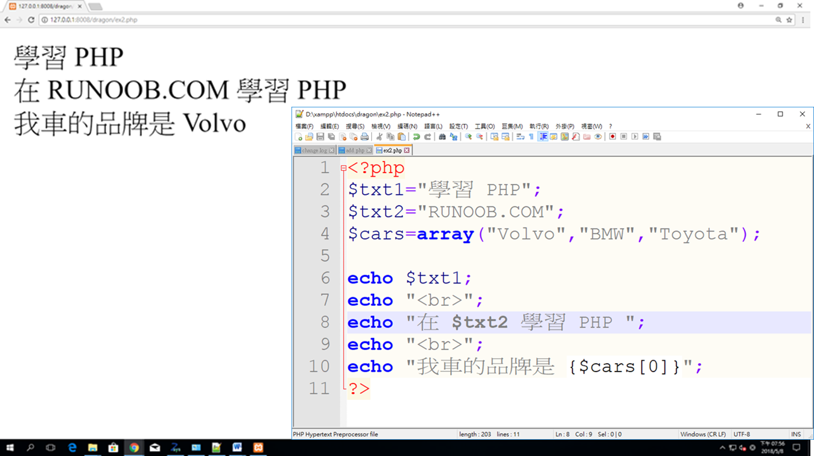

# XAMPP

>* XAMPP是一個把Apache網頁伺服器與PHP、Perl及MariaDB集合在一起的安裝套件
>* XAMPP允許用戶可以在自己的電腦上輕易的建立網頁伺服器。
>* https://zh.wikipedia.org/wiki/XAMPP

v7.2.4 [2018/4/21]
本版本包含 
>* Apache 2.4.33
>* MariaDB 10.1.31
>* PHP 7.2.4
>* phpMyAdmin 4.8.0….

另有使用 PHP v5.6.35 版的程式，可依需求選擇 PHP 5 或 PHP 7.2 來用。


# XAMPP安裝

# 啟動XAMPP

使用系統管理員身分啟動下列執行檔===>xampp-control.exe

# XAMPP目錄結構

D:\xampp

D:\xampp\htdocs===>放你的網站程式

建一個目錄把測試程式放在此目錄

D:\xampp\htdocs\dragon

開啟瀏覽器

http://127.0.0.1:8008/dashboard/

# 程式範例

### 程式範例 1
```
<?php
$txt1="學習 PHP";
$txt2="RUNOOB.COM";
$cars=array("Volvo","BMW","Toyota");
 
echo $txt1;
echo "<br>";
echo "在 $txt2 學習 PHP ";
echo "<br>";
echo "我車的品牌是 {$cars[0]}";
?>
```


### 程式範例 2
```
```


